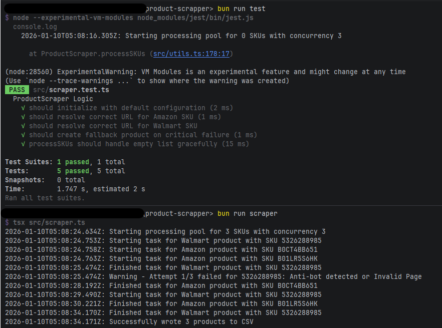
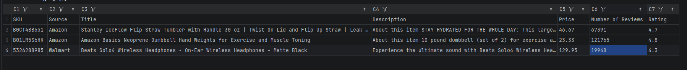

# Product Scraper

## Overview

Welcome to the **Product Scraper** project! This tool is designed to scrape product data from various retailers and save it into a CSV file. It leverages modern TypeScript and powerful libraries like **Playwright** (for browser automation) and **Puppeteer Extra Stealth** (to evade detection) to handle web scraping tasks efficiently.

## Key Features

- **Multi-Retailer Support**: Extracts Title, Description, Price, and Number of Reviews from **Amazon** and **Walmart**.
- **CSV Output**: Automatically organizes and saves the scraped data into a `product_data.csv` file.
- **Stealth Mode**: Integrated with `puppeteer-extra-plugin-stealth` to reduce the likelihood of bot detection.
- **Concurrency Control**: Limits the number of concurrent browser instances (workers) to optimize performance and prevent overloading target servers (Configurable via `utils.ts`).
- **Smart Retry Mechanism**: Automatically retries failed requests (up to 3 times) to handle network instability or temporary blocks.
- **Unit Testing Suite**: Includes Jest-based unit tests to verify scraping logic without requiring a browser instance.

## Assumptions

- **DOM Stability**: It is assumed that Amazon and Walmart will not significantly change their CSS selectors (class
  names/IDs) during the evaluation period.
- **US IP Address**: It is assumed the scraper is running from a US IP address. Prices and availability are logic-bound
  to the request origin location.
- **Node Environment**: Although managed by Bun, it is assumed the environment supports Node.js execution via `tsx` for
  Playwright compatibility on Windows.

## Limitations

While this tool is robust, please be aware of the following technical and functional limitations:

- **Anti-Bot Mechanisms**: Amazon and Walmart employ sophisticated anti-scraping technologies. While the "Stealth"
  plugin helps evade detection, 100% success is not guaranteed. You may occasionally encounter strict CAPTCHAs (e.g.,
  Walmart's "Press & Hold") that the automation cannot bypass.
- **IP Rotation & Proxies**: The tool currently runs on your local network's IP address. It does not include integration
  for paid rotating proxies or residential IP networks. Consequently, running large batches of SKUs carries a higher
  risk of being rate-limited or IP-banned by retailers compared to commercial solutions.
- **Runtime Environment**: Due to compatibility issues with Playwright and Bun on Windows, the scraper execution relies
  on Node.js (via `tsx`) under the hood, even though the project dependencies are managed with Bun.
- **DOM Volatility**: This scraper relies on specific HTML structures and CSS selectors. If retailers update their
  website layout, the scraper may fail to extract data until the selectors in `src/utils.ts` are updated.
- **Geolocation & Pricing**: The browser context is hardcoded to a US geolocation (New York). Prices and availability
  extracted will reflect this region and may differ if you are accessing from a different country.

## Getting Started

### Prerequisites

1. **Bun**: This project uses Bun as the package manager. Download it from [bun.sh](https://bun.sh/).
2. **Node.js**: Required for the execution runtime due to Playwright and Jest compatibility. Download it
   from [nodejs.org](https://nodejs.org/en/download).

### Installation Steps

1. **Clone the Repository and navigate to the directory**:

```shell script
git clone https://github.com/Fran0697/Product-Scrapper.git
cd product-scrapper
```

2. **Install Dependencies**:
   Use Bun to install all necessary packages as defined in `bun.lock` and `package.json`.

```shell script
bun install
```

3. **Prepare Input Data**:
   Ensure you have a JSON file named `skus.json` in the project root directory with the following structure:

```json
{
  "skus": [
    {
      "Type": "Amazon",
      "SKU": "B0CT4BB651"
    },
    {
      "Type": "Walmart",
      "SKU": "5326288985"
    },
    {
      "Type": "Amazon",
      "SKU": "B01LR5S6HK"
    }
  ]
}
```

### Running the Scraper

To execute the scraper, run the following command in your terminal:

```shell script
bun run scraper
```

This command will start the scraping process and save the results to `product_data.csv`.

### Running the test suite

To execute the test suite, run the following command in your terminal:

```shell script
bun run test
```





## 🚀 Quick Start (Standalone Executable)

If you prefer not to install Node.js or build from source, you can run the pre-compiled application directly:

1.  **Download:** Go to the **[Releases](../../releases)** page of this repository and download the latest `.zip` file (e.g., `v1.0.0`).
2.  **Unzip:** Extract the contents into a folder on your computer. You should see `scraper-app.exe` and `skus.json`.
3.  **Modify SKUs:** Open the `skus.json` file with any text editor (like Notepad) and update the list with the Amazon or Walmart SKUs you want to scrape.
4.  **Run:** Double-click `scraper-app.exe`.
5.  **View Results:**
  * The program will open a console window and show progress.
  * Once finished, check the `product_data.csv` file generated in the same folder for your data.
  * Press `ENTER` to close the program.

## Project Structure

Here's a brief overview of the project structure:

- **src/**: Contains the source code.
    - **scraper.ts**: The main script that runs the scraping process.
    - **utils.ts**: Utility functions and configurations for the scraper.
    - **scraper.test.ts**: Unit tests for the scraper logic using Jest and mocks.

- **bun.lock**: Lock file for dependency versions managed by Bun.

- **product_data.csv**: Output CSV file containing scraped product data.

- **errors.log**: Log file for tracking runtime errors.

- **skus.json**: Input JSON file with SKUs to be scraped.

## Troubleshooting

If you encounter any issues, check the `errors.log` file in the project root directory. It logs critical errors that
occur during the scraping process.

Thank you for using Product Scraper for your web scraping needs! If you have any questions or need further assistance,
feel free to open an issue or ask.